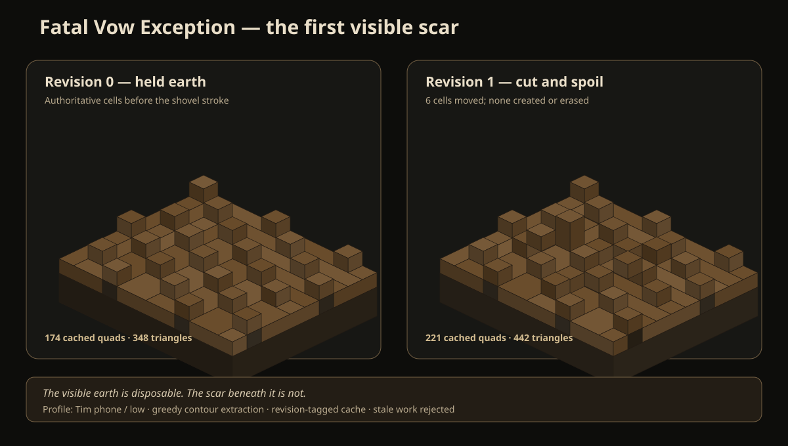

# Fatal Vow Exception

> A free, public, forkable game where the shovel makes decisions remain in the ground.



## The first visible scar

The repository now carries a complete engine-neutral path from deterministic voxel truth to disposable presentation:

1. `scar_contract_v0_1.py` defines the governing scar contract and its fourteen fixtures.
2. `voxel_support_v0_1.mjs` carries only Infinite Brutality's bounded voxel/support substrate.
3. `scar_voxel_authority_v0_1.mjs` turns shovel intent into atomic, conserved, append-only terrain history.
4. `weathered_contour_v0_1.mjs` consumes revision-tagged dirty jobs and greedily extracts cached contour quads without mutating truth.

The witness above is generated by the contour module from two authoritative chunk revisions. Its shovel transaction moves six occupied cells into a spoil bank: none are created or erased. Stale remesh results and wrong renderer profiles are rejected.

Run the current executable contract suite:

```sh
python -m unittest -v scar_contract_v0_1.py
node voxel_support_v0_1.mjs
node scar_voxel_authority_v0_1.mjs
node weathered_contour_v0_1.mjs
```

## Boundary ledger

- Novel truth is not fleshpunk. Grotesque rendering may apply pressure; it may not invent technology, materials, institutions, causality, or combat grammar.
- **3D world, 3D bodies, 2D timing.** Drew remains the actor. Contact sheets remain the animation source, approval surface, and correction language.
- Terrain state and append-only scar events are authority. Meshes, particles, telemetry, and renderer quality are presentation.
- Tim's non-flagship phone is the acceptance device. Stable 30 FPS in a representative Chapter 9 trench battle is still unproven and must not be inferred from fixture size.
- Multiplayer-shaped state contracts exist now. Networking does not.

The player may change the world. The game must tell the truth about who chose, who could refuse, who paid, what remained changed, and which surface owns the scar.
